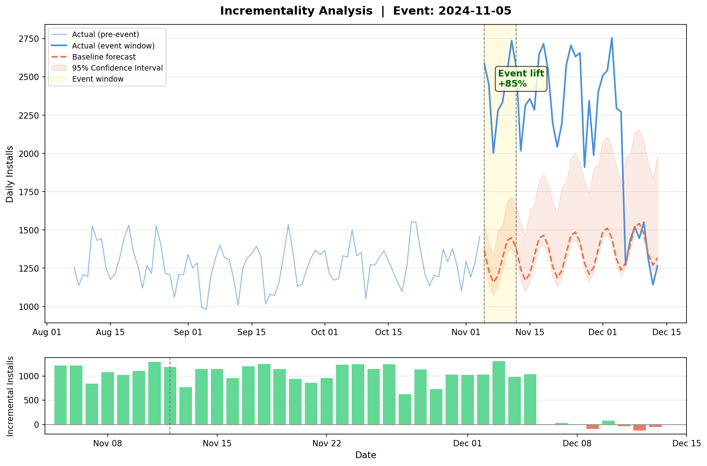

# Incrementality Analysis


Forecast-based incrementality analysis for ASO and user acquisition events. This project includes both a `NeuralProphet` notebook workflow and a standalone browser-based HTML app for interactive analysis, chart export, and CSV export.

## Table of Contents

- [Overview](#overview)
- [Repository Contents](#repository-contents)
- [HTML App](#html-app)
- [Screenshots](#screenshots)
- [Notebook Workflow](#notebook-workflow)
- [Expected Input Data](#expected-input-data)
- [Configuration](#configuration)
- [Outputs](#outputs)
- [How to Run](#how-to-run)
- [How to Interpret Results](#how-to-interpret-results)
- [Use Cases](#use-cases)
- [Notes](#notes)

## Overview

This repository supports the same core incrementality workflow in two formats:

1. Train a baseline model on historical data outside the event window.
2. Forecast expected performance during the event and post-event period.
3. Compare forecast vs. actuals to estimate incremental lift.
4. Measure lift in absolute and percentage terms.
5. Check whether the observed lift is statistically significant.

It is designed for daily time series such as installs, downloads, impressions, units, revenue, or similar app growth metrics.

## Repository Contents

- [`incrementality-analysis-app.html`](/Users/amoexuba/VS%20Code/Python/incrementality-analysis/incrementality-analysis-app.html): standalone interactive HTML app with theme toggle, charts, exports, and synthetic demo data
- [`incrementality-analysis-NeuralProphet-1.3.ipynb`](/Users/amoexuba/VS%20Code/Python/incrementality-analysis/incrementality-analysis-NeuralProphet-1.3.ipynb): notebook workflow using `NeuralProphet`
- [`incrementality_result.png`](/Users/amoexuba/VS%20Code/Python/incrementality-analysis/incrementality_result.png): example chart output from the notebook
- [`incrementality_results.csv`](/Users/amoexuba/VS%20Code/Python/incrementality-analysis/incrementality_results.csv): example exported results
- [`screenshots/incrementality-app-before-analysis.jpeg`](/Users/amoexuba/VS%20Code/Python/incrementality-analysis/screenshots/incrementality-app-before-analysis.jpeg): HTML app before running an analysis
- [`screenshots/incrementality-app-after-analysis.jpeg`](/Users/amoexuba/VS%20Code/Python/incrementality-analysis/screenshots/incrementality-app-after-analysis.jpeg): HTML app after results are generated

## HTML App

The standalone app in [`incrementality-analysis-app.html`](/Users/amoexuba/VS%20Code/Python/incrementality-analysis/incrementality-analysis-app.html) is a single-file browser UI that runs entirely client-side.

### What it does

- Loads CSV, TSV, or TXT data directly in the browser
- Lets you map your own date and metric columns to `ds` and `y`
- Includes synthetic demo data for a quick dry run
- Supports `extrapolation` and `interpolation` analysis modes
- Builds a baseline forecast with trend and Fourier seasonality
- Calculates event-window and post-event lift
- Displays significance summaries, confidence intervals, and lift charts
- Exports chart PNGs and result CSVs
- Supports light and dark themes

### Why use the HTML app

- No notebook environment is required
- Faster for stakeholders who want a visual UI
- Useful for quick scenario checks and screenshot-ready output
- Easier to share internally as a single HTML file

## Screenshots

### HTML App Before Analysis


Before running the model, the interface is organized to make setup fast and readable:

- The left sidebar acts as the control rail. It contains the event window inputs, model mode selector, changepoint and Fourier controls, confidence interval selector, and the main `Run Analysis` button.
- The navigation above the controls mirrors the workflow from top to bottom: data source, event config, model params, and results. This makes it easy to understand where you are in the process before any output exists.
- The top bar keeps the global actions visible without crowding the workspace. Theme switching sits beside export actions, although the export buttons remain inactive until results are available.
- The main panel starts with the `Data Source` card. This is the drop zone for CSV uploads, and it clearly explains the expected schema: `ds` for date and `y` for the metric. The synthetic demo-data shortcut is placed directly below so a first-time user can test the interface immediately.
- The `Run Log` card gives immediate operational feedback. In the pre-analysis state it shows a simple readiness message, which helps orient the user and confirms the app is waiting for data and parameters.
- The `Results` card is intentionally empty before execution. This avoids showing placeholder numbers and instead reserves the space for charts, KPI tiles, and significance panels once the analysis completes.
- Visually, the pre-analysis screen is designed like a focused control room: narrow left column for inputs, large right column for data, logs, and eventual outputs.

### HTML App After Analysis


After the analysis runs, the same layout turns into a reporting dashboard:

- The `Data Source` card now confirms that data has been loaded by showing a preview table and a badge with row count and date coverage. This lets the user validate the input range without leaving the screen.
- The `Run Log` becomes a progress narrative. Instead of a static ready message, it records the main modeling steps such as feature building, model fitting, forecasting, and final completion status.
- The `Results` card changes from an empty placeholder into the core insight area. A KPI strip summarizes total incremental impact, event-window lift, post-event lift, and the size and error profile of the training data.
- Two significance panels break the findings into `event window` and `post-event` sections. Each panel exposes average daily lift, average lift percent, p-value, and a significance status tag, which helps the user separate immediate impact from lingering effect.
- The main forecast chart combines historical actuals, baseline forecast, confidence intervals, and a highlighted event window. This gives the user the full context needed to judge whether the modeled baseline and observed lift look credible.
- The lower bar chart translates the same outcome into daily incremental lift, making it easier to spot which days contributed most to the total effect and whether the post-event tail remains positive.
- Export actions become meaningful in this state. The user can move directly from analysis to a PNG for reporting or a CSV for downstream review.
- The after-analysis view therefore functions as both an analysis workspace and a presentation layer: setup, diagnostics, statistical summary, and visuals all remain on one page.

### Notebook Example Output



The notebook and HTML app both visualize:

- historical pre-event trend
- baseline forecast
- confidence interval band
- highlighted event window
- daily incremental lift bars

## Notebook Workflow

The main notebook lives in [`incrementality-analysis-NeuralProphet-1.3.ipynb`](/Users/amoexuba/VS%20Code/Python/incrementality-analysis/incrementality-analysis-NeuralProphet-1.3.ipynb).

### Features

- In-notebook dependency installation
- Synthetic demo data for an end-to-end example
- Real-data loading patterns for App Store Connect, Google Play Console, and AppTweak exports
- Configurable event windows and post-event measurement period
- `NeuralProphet` baseline forecasting with weekly and yearly seasonality
- Confidence interval handling
- Incremental lift calculation at the daily and total level
- One-sample t-test significance checks
- Exported chart and CSV output for reporting

## Expected Input Data

The analysis expects a dataset with two columns:

- `ds`: date column
- `y`: daily metric to analyze

Example:

```text
ds,y
2024-01-01,1523
2024-01-02,1487
2024-01-03,1602
```

Typical source exports include:

- App Store Connect
- Google Play Console
- AppTweak
- any CSV with one daily date column and one numeric metric column

## Configuration

Core parameters used by both versions of the workflow:

```text
Event start date: 2024-11-05
Event end date:   2024-11-12
Post-event days:  31
Model mode:       extrapolation or interpolation
```

Parameter guide:

- `Event start date`: first day of the ASO or UA event
- `Event end date`: last day of the event
- `Post-event days`: number of extra days to measure lingering impact
- `Model mode`: analysis approach

Supported modes:

- `extrapolation`: train only on pre-event data and forecast forward
- `interpolation`: train on pre-event plus later post-event data while excluding the event window

## Outputs

Generated outputs include:

- chart of actuals vs. baseline forecast
- confidence interval band
- daily incremental lift bars
- event-window and post-event significance summaries
- exported chart PNG
- exported result CSV

Example CSV columns:

- `ds`
- `actual`
- `baseline`
- `lower_95`
- `upper_95`
- `lift_abs`
- `lift_pct`
- `period`

## How to Run

### Standalone HTML App

1. Open [`incrementality-analysis-app.html`](/Users/amoexuba/VS%20Code/Python/incrementality-analysis/incrementality-analysis-app.html) in a browser.
2. Upload your CSV file or click the demo-data option.
3. Map your date and metric columns if needed.
4. Set the event window, post-event duration, and model parameters.
5. Run the analysis and export PNG or CSV if needed.

### Notebook

1. Open [`incrementality-analysis-NeuralProphet-1.3.ipynb`](/Users/amoexuba/VS%20Code/Python/incrementality-analysis/incrementality-analysis-NeuralProphet-1.3.ipynb) in Jupyter or VS Code.
2. Run the dependency installation cell.
3. Keep the synthetic demo data or replace it with your own `ds` and `y` dataset.
4. Set the event parameters.
5. Run the notebook through training, forecasting, significance testing, and export.

## How to Interpret Results

Key outputs to watch:

- average daily lift during the event window
- average lift percentage during the event window
- p-value for the event window
- average daily lift after the event
- p-value for the post-event period
- total incremental lift across the analysis window

Interpretation guide:

- positive `lift_abs` means actual performance was above the estimated baseline
- negative `lift_abs` means actual performance was below baseline
- lower p-values indicate stronger evidence that the observed lift is not random noise
- a p-value below `0.05` is typically treated as statistically significant

## Use Cases

This workflow is useful for measuring the impact of:

- App Store Optimization metadata updates
- store listing experiments
- paid acquisition bursts
- feature launches
- campaign-related changes in installs, impressions, or revenue

## Notes

- The HTML app is fully client-side and does not require a backend.
- The notebook contains a compatibility monkey-patch for `NeuralProphet` with newer `pandas` versions.
- The workflow assumes daily data with reasonably complete historical coverage.
- Missing or malformed dates and metrics should be cleaned before relying on final results.
