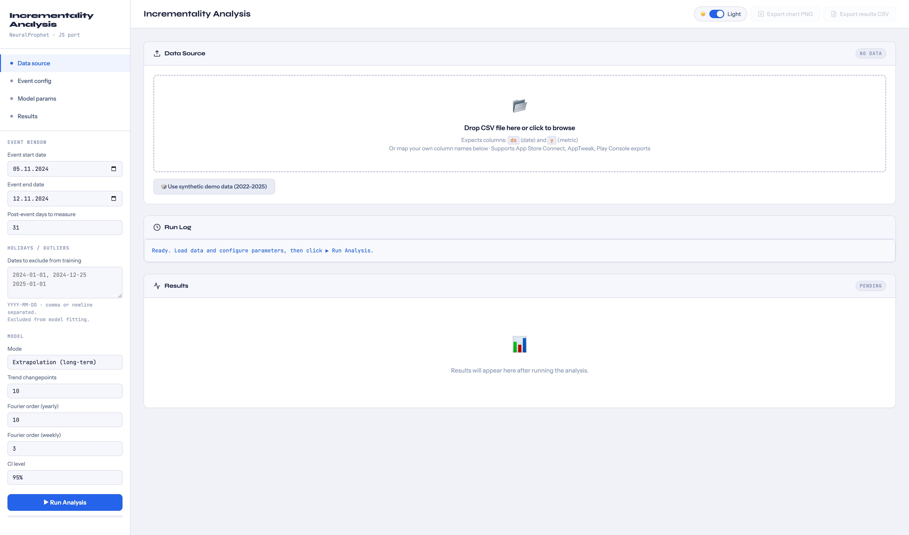
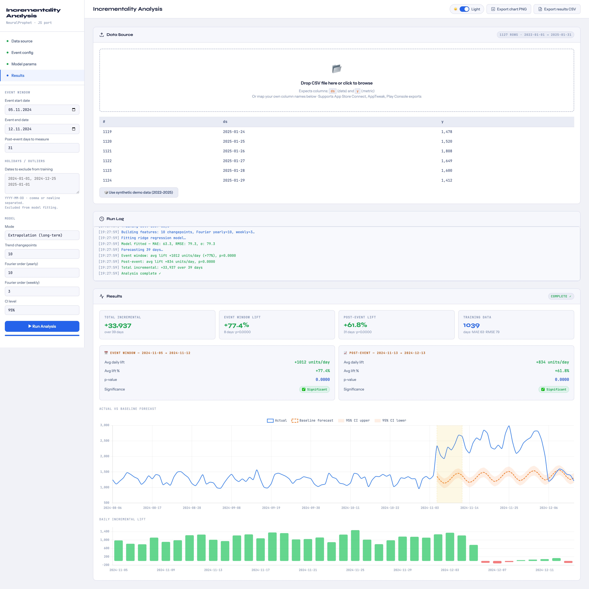
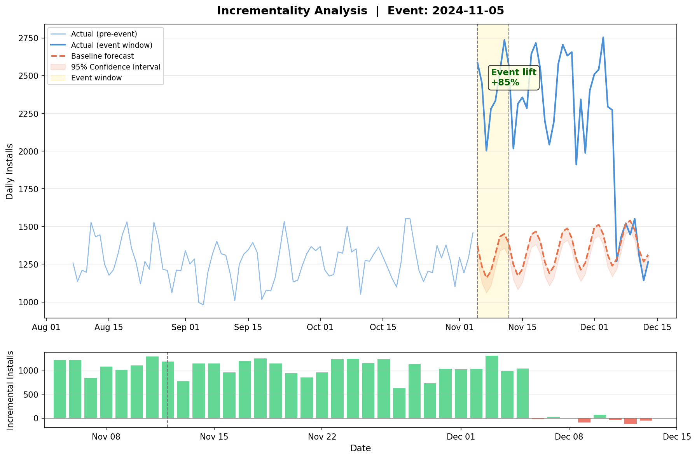

# Incrementality Analysis


Forecast-based incrementality analysis for ASO and user acquisition events. Includes a `NeuralProphet` notebook workflow and a standalone browser-based HTML app for interactive analysis, chart export, and CSV export.

## Table of Contents

- [Overview](#overview)
- [Repository Contents](#repository-contents)
- [HTML App](#html-app)
- [Screenshots](#screenshots)
- [Notebook Workflow](#notebook-workflow)
- [Expected Input Data](#expected-input-data)
- [Configuration](#configuration)
- [Holidays and Outliers](#holidays-and-outliers)
- [Outputs](#outputs)
- [How to Run](#how-to-run)
- [How to Interpret Results](#how-to-interpret-results)
- [Use Cases](#use-cases)
- [Notes](#notes)

## Overview

Both workflow formats follow the same core steps:

1. Train a baseline model on historical data outside the event window.
2. Forecast expected performance during the event and post-event period.
3. Compare forecast vs. actuals to estimate incremental lift.
4. Measure lift in absolute and percentage terms.
5. Check whether the observed lift is statistically significant.

Designed for daily time series: installs, downloads, impressions, revenue, or similar app growth metrics.

## Repository Contents

- [`incrementality-analysis-app-1.1.html`](incrementality-analysis-app-1.1.html): standalone interactive HTML app with theme toggle, charts, exports, and synthetic demo data
- [`incrementality-analysis-NeuralProphet-1.4.ipynb`](incrementality-analysis-NeuralProphet-1.4.ipynb): notebook workflow using `NeuralProphet`
- [`exports/incrementality-analysis-result.png`](exports/incrementality-analysis-result.png): example chart output from the notebook
- [`exports/incrementality-analysis-result.csv`](exports/incrementality-analysis-result.csv): example exported results
- [`exports/incrementality-app-before-analysis.jpeg`](exports/incrementality-app-before-analysis.jpeg): HTML app before running an analysis
- [`exports/incrementality-app-after-analysis.jpeg`](exports/incrementality-app-after-analysis.jpeg): HTML app after results are generated

## HTML App

[`incrementality-analysis-app-1.1.html`](incrementality-analysis-app-1.1.html) is a single-file browser UI that runs entirely client-side.

### Features

- Loads CSV, TSV, or TXT data directly in the browser
- Column mapping for custom date and metric column names (`ds` and `y`)
- Synthetic demo data for a quick dry run
- `extrapolation` and `interpolation` analysis modes
- Baseline forecast with trend and Fourier seasonality
- Configurable Fourier order: yearly (default 10) and weekly (default 3)
- Holiday and outlier date exclusion from model training
- Red marker lines on the forecast chart for each excluded date
- Event-window and post-event lift calculation
- Significance summaries, confidence intervals, and lift charts
- Confidence interval level: 95%, 90%, or 80%
- Chart PNG and result CSV export (CSV includes `is_outlier` column)
- Light and dark theme support

### Why use the HTML app

- No notebook environment needed
- Faster for stakeholders who want a visual UI
- Easy to share as a single HTML file
- Good for quick scenario checks and screenshot-ready output

## Screenshots

### HTML App Before Analysis



The pre-analysis layout is split into a narrow left sidebar for inputs and a large right panel for data, logs, and results:

- **Left sidebar**: event window inputs, model mode selector, Fourier controls, CI selector, and the `Run Analysis` button
- **Top bar**: theme toggle and export actions (exports are inactive until results are available)
- **Data Source card**: CSV drop zone with schema guidance (`ds` for date, `y` for metric) and a demo-data shortcut
- **Run Log card**: shows a readiness message confirming the app is waiting for data and parameters
- **Results card**: empty until execution — reserved for charts, KPI tiles, and significance panels

### HTML App After Analysis



After the analysis runs, the layout becomes a reporting dashboard:

- **Data Source card**: shows a data preview with row count and date coverage
- **Run Log**: records each modeling step — feature building, fitting, forecasting, and completion
- **Results card**: KPI strip with total incremental impact, event-window lift, post-event lift, and training data profile
- **Significance panels**: separate event-window and post-event breakdowns with average daily lift, lift percent, p-value, and significance status
- **Forecast chart**: historical actuals, baseline forecast, confidence intervals, and highlighted event window
- **Bar chart**: daily incremental lift broken down by day
- **Export actions**: PNG for reporting or CSV for downstream review

### Notebook Example Output



Both the notebook and HTML app visualize:

- historical pre-event trend
- baseline forecast
- confidence interval band
- highlighted event window
- daily incremental lift bars

## Notebook Workflow

Main notebook: [`incrementality-analysis-NeuralProphet-1.4.ipynb`](incrementality-analysis-NeuralProphet-1.4.ipynb)

### Features

- In-notebook dependency installation
- Synthetic demo data for an end-to-end example
- Real-data loading patterns for App Store Connect, Google Play Console, and AppTweak exports
- Configurable event windows and post-event measurement period
- `NeuralProphet` baseline forecasting with weekly and yearly seasonality
- Country holidays via `COUNTRY_HOLIDAYS` (e.g. `['US', 'UA']`)
- Outlier date exclusion via `OUTLIER_DATES` (individual dates or date ranges)
- Red marker lines and shaded spans on the output chart for excluded dates
- Confidence interval handling
- Incremental lift calculation at daily and total level
- One-sample t-test significance checks
- Exported chart and CSV output

## Expected Input Data

Two required columns:

- `ds`: date column (`YYYY-MM-DD`)
- `y`: daily numeric metric

```text
ds,y
2024-01-01,1523
2024-01-02,1487
2024-01-03,1602
```

Supported sources: App Store Connect, Google Play Console, AppTweak, or any CSV with a daily date column and a numeric metric column.

## Configuration

Core parameters shared by both workflow versions:

```text
Event start date:    2024-11-05
Event end date:      2024-11-12
Post-event days:     31
Model mode:          extrapolation or interpolation
CI level (HTML):     95%, 90%, or 80%
Fourier yearly:      10 (default)
Fourier weekly:      3 (default)
COUNTRY_HOLIDAYS:    [] (e.g. ['US', 'UA'])
OUTLIER_DATES:       [] (e.g. ['2024-07-04'] or [('2024-12-24', '2024-12-26')])
```

**Parameter reference:**

| Parameter | Description |
|---|---|
| `Event start date` | First day of the ASO or UA event |
| `Event end date` | Last day of the event |
| `Post-event days` | Days to measure lingering impact after the event |
| `Model mode` | Analysis approach (see below) |
| `CI level` | Confidence interval width for charts and significance tests |
| `Fourier yearly` | Fourier terms for yearly seasonality cycles |
| `Fourier weekly` | Fourier terms for within-week patterns |
| `COUNTRY_HOLIDAYS` | ISO country codes whose public holidays are added to the model |
| `OUTLIER_DATES` | Dates or `(start, end)` tuples excluded from training data |

**Model modes:**

- `extrapolation`: trains only on pre-event data and forecasts forward
- `interpolation`: trains on pre-event and post-event data, excluding the event window

## Holidays and Outliers

Both versions support excluding known holidays or anomalous dates from model training to prevent them from skewing the baseline.

### HTML App

In the sidebar under **Holidays / Outliers**, enter dates in `YYYY-MM-DD` format separated by commas or newlines. Excluded dates are removed from the training set before fitting and drawn as red dashed vertical lines on the forecast chart. The exported CSV includes an `is_outlier` column. A warning is logged if excluded dates exceed 10% of the training data.

### Notebook

In **Section 3.5 — Holidays / Outliers**, set these variables before running:

```python
COUNTRY_HOLIDAYS = ['US']         # ISO country codes — passed to NeuralProphet
OUTLIER_DATES = [
    '2024-07-04',                 # individual date
    ('2024-12-24', '2024-12-26'), # inclusive date range
]
```

`COUNTRY_HOLIDAYS` passes each code to `model.add_country_holidays()`, adding public holidays to the model. `OUTLIER_DATES` removes the specified dates from the training DataFrame before fitting. Excluded dates appear on the output chart as red dotted lines (single dates) or light red shaded spans (ranges).

## Outputs

| Output | Description |
|---|---|
| Forecast chart | Actuals vs. baseline, confidence band, event window, and lift bars |
| Significance summary | Event-window and post-event lift, p-values, and status |
| Chart PNG | Exported via the app or notebook |
| Result CSV | Per-day metrics with `is_outlier` column |

**CSV columns:** `ds`, `actual`, `baseline`, `lower_95`, `upper_95`, `lift_abs`, `lift_pct`, `period`, `is_outlier`

## How to Run

### HTML App

1. Open [`incrementality-analysis-app-1.1.html`](incrementality-analysis-app-1.1.html) in a browser.
2. Upload a CSV file or use the demo-data option.
3. Map your date and metric columns if needed.
4. Set the event window, post-event duration, CI level, and model parameters.
5. Optionally enter holiday or outlier dates under **Holidays / Outliers**.
6. Run the analysis and export PNG or CSV as needed.

### Notebook

1. Open [`incrementality-analysis-NeuralProphet-1.4.ipynb`](incrementality-analysis-NeuralProphet-1.4.ipynb) in Jupyter or VS Code.
2. Run the dependency installation cell.
3. Use the synthetic demo data or replace it with your own `ds` and `y` dataset.
4. Set the event parameters.
5. In **Section 3.5**, configure `COUNTRY_HOLIDAYS` and `OUTLIER_DATES` if needed.
6. Run through training, forecasting, significance testing, and export.

## How to Interpret Results

| Metric | Meaning |
|---|---|
| `lift_abs` > 0 | Actuals exceeded the baseline forecast |
| `lift_abs` < 0 | Actuals were below the baseline forecast |
| Low p-value | Stronger evidence the lift is not random noise |
| p-value < 0.05 | Conventionally treated as statistically significant |

Key values to review: average daily lift and lift % for the event window and post-event period, p-values for each period, and total incremental lift across the analysis window.

## Use Cases

Suitable for measuring the impact of:

- App Store Optimization metadata updates
- Store listing experiments
- Paid acquisition bursts
- Feature launches
- Campaign-driven changes in installs, impressions, or revenue

## Notes

- The HTML app is fully client-side and requires no backend.
- The notebook includes a compatibility patch for `NeuralProphet` with newer `pandas` versions.
- The workflow assumes daily data with reasonably complete historical coverage.
- Clean missing or malformed dates and metrics before running the analysis.
- Excluding more than ~10% of training rows can reduce model accuracy — use the outlier feature selectively.
